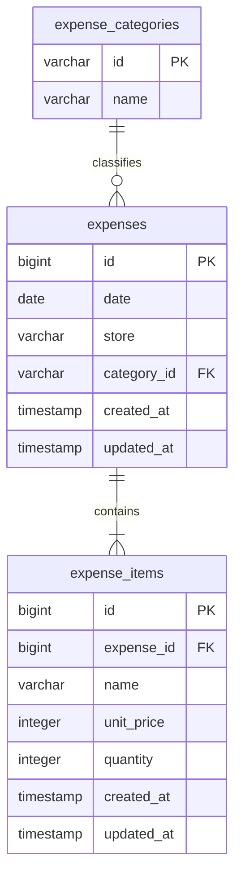

# 家計簿DB設計とAPI v1

既存Laravelに家計簿APIを追加する。クレカ管理画面は同じLaravelに維持し、家計簿フロントとはJSON APIで接続する。DBは既存MySQLの `kakeibo` を共通利用する。

## ER構成



- `expense_categories`: 画面と共通の9カテゴリをマイグレーションで登録。カテゴリ削除は参照があれば拒否。
- `expenses`: 支出1件（レシート相当）。日付・店舗にインデックス。店舗は入力値を保存し、候補は重複を除いて返す。
- `expense_items`: 支出に属する品目。親支出削除時に連動削除。登録は親子まとめてトランザクションで行う。
- 金額は日本円の整数。合計金額は保存せず、品目の単価×数量から算出し、不整合を防ぐ。月次集計はSQLで集約する。
- APIではIDは文字列、金額・数量は数値、日付は `YYYY-MM-DD`。DBのsnake_caseをResourceで画面のcamelCaseへ変換。
- 単価0〜100,000,000円、数量1〜10,000、品目1〜100件。日付は1000〜9999年の有効日付。小数・負数は受け付けない。
- 現時点はローカル開発用の単一家計簿。認証・ユーザー別アクセス制御は未実装。複数ユーザーで公開する前に所有者設計と認証が必要。
- クレカ明細との連携、支出更新・削除、カテゴリ編集は今回のAPI範囲外。

## マイグレーション

`household-env` で実行する。

```bash
docker compose exec kakeibo-app php artisan migrate
docker compose exec kakeibo-app php artisan migrate:status
```

対象ファイル: `database/migrations/2026_09_06_000001_create_household_expense_tables.php`。既存テーブルは変更しない。`down()` は追加した3テーブルを削除するため、データ登録後のロールバックはデータを失う。`migrate:fresh` は使わない。

## エンドポイント

直接: `http://localhost:8080/api/v1`。Docker家計簿フロント経由: `http://localhost:5174/api/v1`。

| メソッド | パス | 内容 |
|---|---|---|
| POST | `/expenses` | 支出と品目を登録（201） |
| GET | `/expenses?date=2026-09-06` | 指定日の支出一覧（ID昇順） |
| GET | `/monthly-summary?year=2026&month=9` | 月次合計・日別金額と件数・カテゴリ別金額と構成比 |
| GET | `/stores` | 登録済み店舗の候補（重複除外、DBの照合順） |

`Accept: application/json` を使用し、POSTは `Content-Type: application/json` で送信。成功時は `data` ラッパーなしで返す。入力エラーは422で `message` とフィールド別 `errors` を返す。

登録リクエスト例:

```json
{"date":"2026-09-06","store":"スーパー","category":"food","items":[{"name":"りんご","unitPrice":150,"quantity":2}]}
```

登録レスポンス例:

```json
{"id":"1","date":"2026-09-06","store":"スーパー","category":"food","items":[{"id":"1","name":"りんご","unitPrice":150,"quantity":2}],"total":300}
```

日別一覧は上記支出オブジェクトの配列。対象がなければ空配列。

月次レスポンス例:

```json
{"year":2026,"month":9,"total":300,"dailyTotals":[{"date":"2026-09-06","amount":300,"count":1}],"categoryTotals":[{"category":"food","amount":300,"percentage":100}]}
```

日別は日付昇順、カテゴリは金額降順。構成比は小数第1位に丸め、合計0円なら0。空月は合計0と空配列を返す。件数は品目数ではなく支出件数。

## フロント接続と検証

家計簿の `ExpenseApi` インターフェースに合わせたレスポンスを実装済み。フロントの `HttpExpenseApi` から上記4エンドポイントへ接続済み。Docker開発中はViteが `/api` をLaravelへ転送する。

```bash
docker compose exec kakeibo-app php artisan test
```

FeatureテストはSQLiteのインメモリDBを利用し、共通MySQLの実データを消去しない。登録・明細保存・日別絞り込み・月境界・集計・店舗重複除外・空月・0円・入力検証・トランザクションを確認する。
