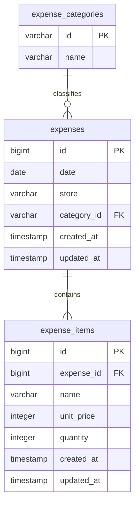

# 家計簿DB設計とAPI v1

既存Laravelに家計簿APIを追加する。クレカ管理画面は同じLaravelに維持し、家計簿フロントとはJSON APIで接続する。DBは既存MySQLの `kakeibo` を共通利用する。

## ER構成



- `expense_categories`: 初期9カテゴリをマイグレーションで登録。設定画面から追加可能で、名前に一意制約を持つ。カテゴリ削除は参照があれば拒否。
- `expenses`: 支出1件（レシート相当）。日付・店舗にインデックス。店舗は入力値を保存し、候補は重複を除いて返す。
- `expense_items`: 支出に属する品目。親支出削除時に連動削除。登録は親子まとめてトランザクションで行う。
- 金額は日本円の整数。合計金額は保存せず、品目の単価×数量から算出し、不整合を防ぐ。月次集計はSQLで集約する。
- APIではIDは文字列、金額・数量は数値、日付は `YYYY-MM-DD`。DBのsnake_caseをResourceで画面のcamelCaseへ変換。
- 単価0〜100,000,000円、数量1〜10,000、品目1〜100件。日付は1000〜9999年の有効日付。小数・負数は受け付けない。
- 現時点はローカル開発用の単一家計簿。認証・ユーザー別アクセス制御は未実装。複数ユーザーで公開する前に所有者設計と認証が必要。
- クレカ明細との連携、支出削除、カテゴリ編集は今回のAPI範囲外。

## マイグレーション

`household-env` で実行する。

```bash
docker compose exec kakeibo-app php artisan migrate
docker compose exec kakeibo-app php artisan migrate:status
```

対象ファイル: `database/migrations/2026_09_06_000001_create_household_expense_tables.php`。既存テーブルは変更しない。`down()` は追加した3テーブルを削除するため、データ登録後のロールバックはデータを失う。`migrate:fresh` は使わない。

## エンドポイント

直接: `http://localhost:8080/api/v1`。Docker家計簿フロント経由: `http://localhost:5174/api/v1`。

| メソッド | パス | 内容 |
|---|---|---|
| POST | `/expenses` | 支出と品目を登録（201） |
| GET | `/expenses?date=2026-09-06` | 指定日の支出一覧（ID昇順） |
| GET | `/monthly-summary?year=2026&month=9` | 月次合計・日別金額と件数・カテゴリ別金額と構成比 |
| GET | `/stores` | 登録済み店舗の候補（重複除外、DBの照合順） |

`Accept: application/json` を使用し、POSTは `Content-Type: application/json` で送信。成功時は `data` ラッパーなしで返す。入力エラーは422で `message` とフィールド別 `errors` を返す。

登録リクエスト例:

```json
{"date":"2026-09-06","store":"スーパー","category":"food","items":[{"name":"りんご","unitPrice":150,"quantity":2}]}
```

登録レスポンス例:

```json
{"id":"1","date":"2026-09-06","store":"スーパー","category":"food","items":[{"id":"1","name":"りんご","unitPrice":150,"quantity":2}],"total":300}
```

日別一覧は上記支出オブジェクトの配列。対象がなければ空配列。

月次レスポンス例:

```json
{"year":2026,"month":9,"total":300,"dailyTotals":[{"date":"2026-09-06","amount":300,"count":1}],"categoryTotals":[{"category":"food","amount":300,"percentage":100}]}
```

日別は日付昇順、カテゴリは金額降順。構成比は小数第1位に丸め、合計0円なら0。空月は合計0と空配列を返す。件数は品目数ではなく支出件数。

## フロント接続と検証

### カテゴリ管理

`GET /api/v1/categories` は全カテゴリを `[{id, name}]` 形式で返す（名前順）。`POST /api/v1/categories` はJSON `{ "name": "お酒" }` を受け、201で `{id, name}` を返す。追加カテゴリのIDはサーバー生成のULIDで、既存カテゴリIDは変更しない。

名前は前後の空白・全角空白を除去し、必須・50文字以内・改行／制御文字なし・重複なしを検証する。CSVで名前とIDの解釈が衝突しないよう、既存IDと同じ名前も拒否する。入力エラーは422の `errors.name`。DBの一意制約により同名の同時登録も防ぐ。

`2026_09_07_000002_add_unique_name_to_expense_categories.php` で名前の一意制約を追加する。既存レコードは変更しない。追加カテゴリは通常の支出登録・CSV取り込み・集計で利用可能。名称変更・削除・表示色の編集は今回の機能には含めない。

### CSVインポート

設定画面 `/#/settings/import` から共通テンプレートCSVを取り込む。

| メソッド | パス | 内容 |
|---|---|---|
| POST | `/expense-imports/preview` | 全行の検証・件数・合計・先頭20件のプレビュー（200、保存なし） |
| POST | `/expense-imports` | 全行を再検証し一括登録（201、取り込み済みなら200） |

いずれも `/api/v1` 配下。multipart/form-dataで `file` と `encoding`（`UTF-8` / `SJIS-win`）を渡す。

CSVのヘッダーは `日付,店舗,カテゴリ,品目,単価,数量` の順。UTF-8 BOM、Shift_JIS、引用符で囲まれたカンマ・改行、二重引用符のエスケープに対応。空行は無視し、1行を1支出・1品目として保存する。カテゴリは日本語ラベルまたはID。単価・数量は桁区切りのない整数。他の範囲は通常の支出登録と同じ。1ファイル2MB・1,000支出まで。

プレビューは `{count, total, rows, alreadyImported, unknownCategories}`。`rows` は先頭20件の `{line, date, store, category, items}`。未登録カテゴリの行には `categoryName` も返す。`unknownCategories` は全行を対象に未登録名を重複除外した配列。`line` はCSV内の物理行番号。登録結果は `{importedCount, alreadyImported}`。重複時は `importedCount: 0`。422時は `errors.file` / `errors.encoding` / `errors.rows` にメッセージを返す。行エラーは最大50件を返し、部分登録しない。

フロントで未登録名を一覧表示し、ユーザーが明示的に承認した場合だけ、登録リクエストの `approved_categories[]` に承認された名前を送る。未承認の新規カテゴリがあれば422の `errors.categories` で拒否する。空欄・50文字超・改行や制御文字を含むカテゴリはプレビュー時に拒否する。カテゴリ作成・支出・履歴を同一トランザクションで保存し、失敗時はすべてロールバックする。プレビューではカテゴリを保存しない。再送時は登録済みカテゴリのIDで正規化して従来のハッシュと照合し、二重登録を防ぐ。

新規マイグレーション `2026_09_07_000001_create_expense_imports_table.php` で `expense_imports` を追加する。カラムは `id`、`fingerprint`（SHA-256・unique）、`expense_count`、`created_at`。正規化した全支出と行順のハッシュを記録し、同じ内容の再送・同時送信を一意制約で防ぐ。履歴と支出・品目は同一トランザクションで保存するため、途中で失敗しても全件ロールバックできる。元ファイルは保存しない。

この仕組みはファイル単位の再送防止であり、既存支出との行単位の重複判定ではない。行を追加・変更・並べ替えたファイルは別の取り込みになる。認証と家計の所有者管理を導入する際は、一意性の範囲も家計単位に変更する。

### 自動テスト

家計簿の `ExpenseApi` インターフェースに合わせたレスポンスを実装済み。フロントの `HttpExpenseApi` から上記4エンドポイントへ接続済み。Docker開発中はViteが `/api` をLaravelへ転送する。

```bash
docker compose exec kakeibo-app php artisan test
```

FeatureテストはSQLiteのインメモリDBを利用し、共通MySQLの実データを消去しない。登録・明細保存・日別絞り込み・月境界・集計・店舗重複除外・空月・0円・入力検証・トランザクションを確認する。

## 支出の編集

- `GET /api/v1/expenses/{id}`: 品目を含む支出1件を取得。存在しないIDは404。
- `PUT /api/v1/expenses/{id}`: POSTと同じ日付・店舗・カテゴリ・品目の全体を送信し更新。200で更新後の支出を返す。入力制約は新規登録と共通。
- 親支出IDを維持し、品目はトランザクション内で置き換える（品目IDは再採番）。失敗時は親子とも元に戻る。日次・月次集計は更新内容から計算する。
- CSV取り込み済み支出も編集可能。取り込み履歴は維持し、同じCSVの再取り込みで編集内容を上書きしない。
